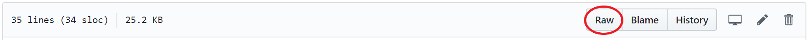

# MDS Github Course Downloader for Windows

## Overview
There are many courses on the Master of Data Science homepage. Manually clicking into each course directory and downloading the contents can quickly become tedious. Copycatting [Ian Flores](https://github.com/ian-flores/github_downloader), this script is the Windows version with the same intention: clones all the course directories and removes the .git files for ease of reuploading onto Github.com repositories.

## Usage
1. Navigate to your MDS course homepage (```https://github.ubc.ca/MDS-2018-19/USERNAME_home```)

2. Click into the README file and again into the raw file


3. Copy the raw file url

4. Clone this repository

5. Run the following in bash: ```python get_courses.py <raw file url>```

## Dependencies
```
This script is written for github.ubc.ca using HTTPS login.

Python 3.6.5
  - argparse 1.4.0
  - pandas 0.23.4
```
# MDS_courses
